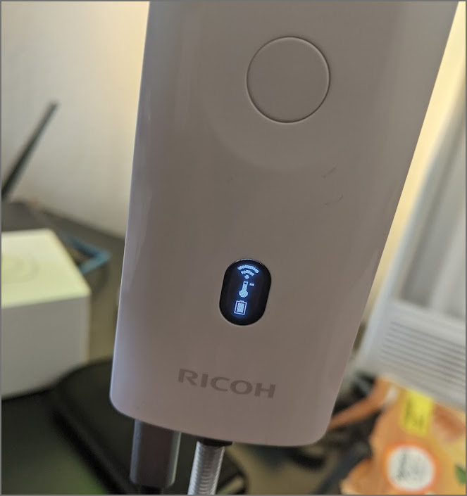

# SC2 Download Speed Test

## Summary


| Overall Test # | download speed | Tests Series | # in Series | Note |
| --------- | ----------- | ------- | --------- | ---------|
| 1 | 913kbps | 1 | 1 | all series 1 use windows computer, 1.2GB file |
| 2 | camera shut down | 1 | 2 | thermometer icon appeared on OLED |
| 3 | 869kbps | 2 | 1 | same equipment and file as series 1 |
| 4 | 982kbps | 2 | 2 | delay 10 seconds between automated tests |
| 5 | 1032kbps | 2 | 3 | |
| 6 | 947kbps | 2 | 4 | |
| 7 | 799kbps | 2 | 5 | |
| 8 |         | 3 | 1 | using 194MB file |


## Background on reported problem

RICOH partner reporting inconsistent results of downloading
large video file

* SC2 with firmware 1.64
* SC2 is 30cm (less than 0.5m away) from Android device
* there is no barrier between the SC2 and the Android device (no case. no wall)
* out of multiple tests in 1 hour, SC2 download will fail in a few hours

## Oppkey test configuration Craig - 1

* uses Windows 10 computer for ease of testing
* [Intel Wireless-N 7260](https://ark.intel.com/content/www/us/en/ark/products/75174/intel-wirelessn-7260.html) USB adapter

### camera info

* firmware 1.64
* camera is plugged in

```
"manufacturer": "RICOH",
"model": "RICOH THETA SC2",
"serialNumber": "20001005",
"firmwareVersion": "01.64",
```

### test file info

* video file
* 1.2GB in size


```
{
  "name": "camera.listFiles",
  "results": {
    "entries": [
      {
        "name": "R0012311.MP4",
        "fileUrl": "http://192.168.1.1/files/thetasc26c21a247d9055838792badc5/100RICOH/R0012311.MP4",
        "size": 1227220343,
        "isProcessed": true,
        "previewUrl": "",
        "dateTimeZone": "2021:10:12 10:24:08-07:00",
        "lng": 0,
        "lat": 0,
        "width": 3840,
        "height": 1920,
        "_thumbSize": 9036,
        "_recordTime": 180
      }
    ],
```

## Results


## Series #1, test #1

* Average download is 913kbps

```
$ bash sc2_download.sh
  % Total    % Received % Xferd  Average Speed   Time    Time     Time  Current
                                 Dload  Upload   Total   Spent    Left  Speed
100 1170M  100 1170M    0     0   869k      0  0:22:57  0:22:57 --:--:--  758k
```

## Series #1, test #2

* SC2 overheated
* thermometer icon displayed on OLED
* camera shutdown



---

## Series 2: Restart Another Series of 5 Tests

### Series 2, tests 1 - 5

941kbps

```
Start test 1
  % Total    % Received % Xferd  Average Speed   Time    Time     Time  Current
                                 Dload  Upload   Total   Spent    Left  Speed
100 1170M  100 1170M    0     0   941k      0  0:21:12  0:21:12 --:--:--  875k
completed test 1
```

waited 10 seconds before starting each additional test

```
Start test 2
  % Total    % Received % Xferd  Average Speed   Time    Time     Time  Current
                                 Dload  Upload   Total   Spent    Left  Speed
  2 1170M    2 26.0M    0     0  1027k      0  0:19:26  0:00:25  0:19:01  994k
100 1170M  100 1170M    0     0   982k      0  0:20:20  0:20:20 --:--:-- 1319k
completed test 2
-------------
Start test 3
  % Total    % Received % Xferd  Average Speed   Time    Time     Time  Current
                                 Dload  Upload   Total   Spent    Left  Speed
100 1170M  100 1170M    0     0  1032k      0  0:19:21  0:19:21 --:--:-- 1189k
completed test 3
-------------
Start test 4
  % Total    % Received % Xferd  Average Speed   Time    Time     Time  Current
                                 Dload  Upload   Total   Spent    Left  Speed
100 1170M  100 1170M    0     0   947k      0  0:21:05  0:21:05 --:--:-- 1327k
completed test 4
-------------
Start test 5
  % Total    % Received % Xferd  Average Speed   Time    Time     Time  Current
                                 Dload  Upload   Total   Spent    Left  Speed
100 1170M  100 1170M    0     0   788k      0  0:25:19  0:25:19 --:--:-- 1087k
completed test 5
-------------
```

### Test Series 3

194MB file.  
Same equipment as test series 1 and 2.

